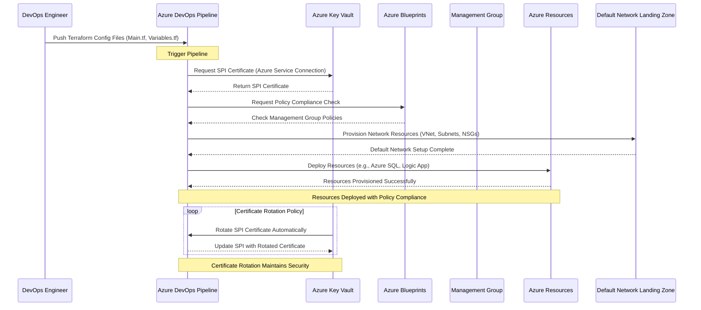

# Deploy-Into-Azure-using-Terraform

Here's a detailed mermaid sequence diagram with a use case that integrates **Azure Key Vault** for managing Service Principal Identity (SPI) using certificates and rotation, **Azure Blueprint** for governance at the management group level, and a default **landing zone** for networking.

### Use Case: 
You have an Azure environment with a management group to enforce policies via **Azure Blueprints**. Resources are deployed using **Azure DevOps pipelines** with **Terraform**, where **Service Principal identities** (SPIs) authenticate via certificates stored in **Azure Key Vault**. A **network landing zone** is also established, governed by the blueprint.

### Explanation of the Diagram Steps

1. **DevOps Engineer Pushes Terraform Configurations**: The DevOps engineer pushes Terraform configurations (such as `main.tf` and `variables.tf`) to the **Azure DevOps Git repository**. This triggers a pipeline in Azure DevOps.

2. **Azure DevOps Requests SPI Certificate**: The Azure DevOps pipeline authenticates using a **Service Principal Identity (SPI)**. It retrieves the associated certificate from **Azure Key Vault**, which has been configured to securely store and manage these certificates.

3. **Policy Compliance Check with Azure Blueprints**: Before deploying resources, the pipeline checks with **Azure Blueprints** to ensure the resources being deployed comply with the policies defined at the **management group level** (e.g., security, tagging, and cost management policies).

4. **Provision Network Resources in Landing Zone**: The pipeline provisions networking resources in a predefined **landing zone** for networking. This may include Virtual Networks (VNets), Subnets, Network Security Groups (NSGs), and User Defined Routes (UDRs) that are compliant with organizational standards.

5. **Deploy Resources (e.g., Azure SQL, Logic Apps)**: After networking is set up, the pipeline proceeds to deploy Azure resources, such as Azure SQL Databases and Logic Apps, using Terraform. These resources are now compliant with the governance policies enforced by the **Azure Blueprint**.

6. **Certificate Rotation in Key Vault**: The **Azure Key Vault** manages and automatically rotates the SPI certificates periodically. The Azure DevOps pipeline is notified when certificates are rotated and can automatically retrieve and update the Service Principal with the new certificate, maintaining security.

---

### Key Components

- **Azure Key Vault**: Stores the Service Principal's certificates securely, automates certificate rotation, and ensures that the certificates are updated without manual intervention.
- **Azure Blueprints**: Enforces policies at the management group level to ensure that all resources deployed are compliant with organizational standards (security, governance, and cost management).
- **Landing Zone**: A pre-configured networking environment (Virtual Networks, Subnets, etc.) that provides a secure and organized foundation for resource deployment.
- **Azure DevOps Pipeline**: Automates the deployment of resources using Terraform, retrieving certificates from Azure Key Vault for secure authentication.

This workflow ensures secure, policy-compliant resource deployment into Azure using a combination of Terraform, Azure DevOps, Key Vault, and Azure Blueprints.
