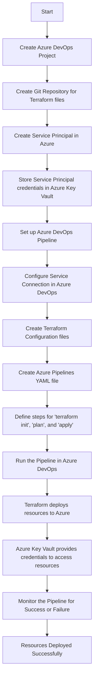

# Deploy-Into-Azure-using-Terraform

Here is a **Mermaid diagram** representing the steps involved in using Azure DevOps with Terraform to deploy resources in Azure, including Azure Key Vault for managing Service Principal credentials.

### Breakdown of Steps in the Diagram:
- **A**: Start the process.
- **B**: Create a new project in Azure DevOps.
- **C**: Set up a Git repository where your Terraform configuration files will reside.
- **D**: Create a Service Principal (SP) in Azure for authentication purposes.
- **E**: Store the SP credentials securely in Azure Key Vault.
- **F**: Set up an Azure DevOps pipeline for automation.
- **G**: Configure the pipeline to access the SP credentials via a Service Connection.
- **H**: Write Terraform configuration files (`*.tf`) to define your Azure resources.
- **I**: Create the pipeline YAML file (`azure-pipelines.yml`) in the repo to automate Terraform steps.
- **J**: Define Terraform steps for initialization (`init`), planning (`plan`), and applying (`apply`) changes.
- **K**: Trigger the pipeline run.
- **L**: Terraform executes the deployment of resources (e.g., VMs, SQL databases) into Azure.
- **M**: Azure Key Vault manages the Service Principal credentials used by Terraform for authentication.
- **N**: Monitor the pipeline for successful deployment or handle failures.
- **O**: Confirm that the resources have been deployed successfully.

This flow emphasizes both the Terraform pipeline and the secure management of Service Principal credentials via Azure Key Vault.
