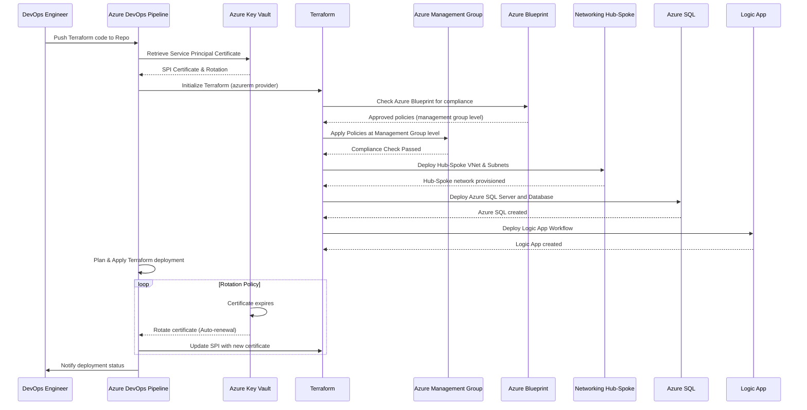

# Deploy-Into-Azure-using-Terraform

Here’s a detailed **Mermaid sequence diagram** that visually represents the steps involved in using Azure DevOps (AzDevOps) with Terraform (TF) to deploy resources into Azure, with the inclusion of **Azure Key Vault** for managing Service Principal (SPI) certificates, **certificate rotation**, **Azure Blueprint at the management group level**, and **Landing Zones for Networking Hub-Spoke architecture**.

### Explanation of the Steps:
1. **DevOps Engineer**:
   - Pushes Terraform configuration to the **Azure DevOps** repository. This starts the CI/CD pipeline.
  
2. **Azure DevOps Pipeline**:
   - **Azure DevOps** triggers the pipeline to deploy resources.
   - Retrieves the **Service Principal Identity (SPI) certificate** from **Azure Key Vault** for authentication. **Azure Key Vault** manages the certificate rotation, and the pipeline will use this certificate to authenticate deployments.
  
3. **Terraform Initialization**:
   - **Terraform** is initialized using the `azurerm` provider, and backend storage (e.g., Azure Storage) is used to store the Terraform state file.

4. **Azure Blueprint Check**:
   - **Terraform** checks for compliance with **Azure Blueprint** (assigned at the **management group** level). The blueprint ensures that the resources being deployed comply with organizational policies such as tagging, security, and resource limits.

5. **Management Group Policy Application**:
   - Policies from the management group are applied to ensure that resources like VNets, Azure SQL, and Logic Apps are created in a compliant manner.

6. **Networking Hub-Spoke Deployment**:
   - **Terraform** provisions a Hub-Spoke network, deploying the virtual network (VNet), subnets, and NSGs.
   
7. **Azure SQL Deployment**:
   - Terraform deploys an Azure SQL Server and database into the designated resource group, ensuring that the deployment adheres to the policies defined in the **Azure Blueprint**.
   
8. **Logic App Deployment**:
   - **Terraform** deploys an **Azure Logic App** for workflow automation based on the configuration provided.

9. **Certificate Rotation Policy**:
   - **Azure Key Vault** automatically rotates the SPI certificate based on the predefined rotation policy (e.g., 30 days before expiry).
   - **Azure DevOps** fetches the new certificate from **Key Vault** during the next pipeline run and updates the **Terraform** SPI authentication.

10. **Deployment Status**:
   - **Azure DevOps** completes the deployment and notifies the **DevOps Engineer** of the deployment status (success/failure).

### Final Thoughts:
This sequence diagram incorporates key components such as **Azure Key Vault** for managing SPI certificates and rotation, **Azure Blueprints** for governance, and **Terraform** for deploying resources into a **Hub-Spoke network architecture** with additional resources like **Azure SQL** and **Logic Apps**. The diagram also highlights the interaction between these components and how they work together in an automated pipeline setup.
