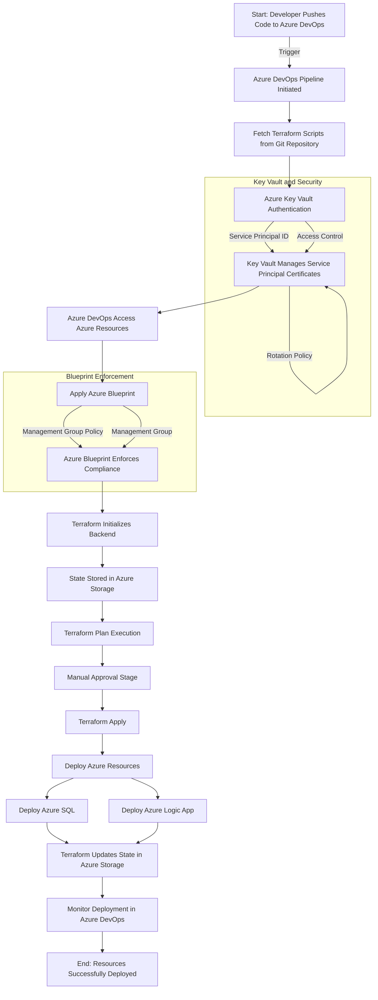

# Deploy-Into-Azure-using-Terraform

Here's a detailed **Mermaid flowchart** diagram showing the process of using Azure DevOps with Terraform to deploy resources in Azure, including the use of **Azure Key Vault** for managing Service Principal Identities (SPI) and **Azure Blueprint** at the management group level.

### Explanation:
- **Key Vault and Security**: Shows how Azure Key Vault is used to store and manage Service Principal credentials, including automated certificate rotation.
- **Blueprint Enforcement**: Demonstrates how Azure Blueprints are applied to ensure compliance at the management group level before any resources are deployed.
- **Terraform Steps**: Shows the flow from initializing Terraform, running a `plan`, manual approval (if necessary), and `apply` stages that deploy resources such as Azure SQL and Logic App.
- **State Management**: Terraform state is stored in Azure Storage, ensuring consistent state tracking across different runs.

This flow represents a complete lifecycle from code push to resource deployment, ensuring security and governance using Azure Key Vault and Blueprints.
